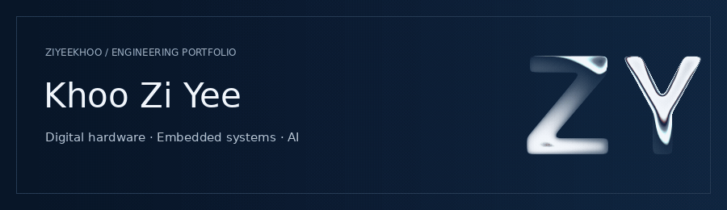
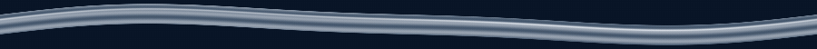

  

  <b>B.Eng (Hons) Electrical & Computer Systems Engineering · Minor in Artificial Intelligence</b> 
  Monash University · Electrical & Electronic Engineering Exchange at The University of Sheffield

---

## About

⚡ Interested in the intersection of digital design, computer architecture, embedded systems and semiconductor hardware.

Exploring opportunities across RTL/FPGA, SoC/ASIC design, verification, implementation and hardware engineering.

## Engineering Focus

- 🧩 **SoC & Digital Systems** : CPU / SoC architecture, digital system design, hardware IP integration, interconnects, NoC and memory hierarchy
- 💻 **RTL / Digital Design** : Verilog / SystemVerilog, datapaths, ALUs, FSMs and FPGA prototyping
- 🖥️ **Computer Architecture** : CPU pipelines, caches, memory systems, parallelism and hardware/software interaction
- 🔍 **Verification** : RTL verification, testbenches, functional testing and debugging
- 🏭 **ASIC / Silicon Development** : synthesis, timing / STA, physical-design fundamentals and RTL-to-silicon workflows
- 🔧 **Hardware Validation** : board-level debugging, firmware/hardware interaction, automated testing and post-silicon validation

## Selected Work

🧠 <b>16-bit Multi-Cycle CPU — Verilog / FPGA</b>

**DE10-Lite**

Designed and implemented a 16-bit multi-cycle processor in Verilog.

- 8-register datapath, ALU, ROM and control FSM
- `MOVI`, `ADDI`, `ADD`, `SUB`, `MUL`, `SSI`, `DISP`
- 4-tick multi-cycle control FSM
- **21,662 / 21,662 test cases passed**
- **150.94 MHz ALU Fmax**
- 241 logic elements · 51 registers · 2 DSP blocks

**Verilog · RTL · FPGA · CPU Architecture · FSM · Verification**

📡 <b>Motorola Solutions — Electrical Engineering Intern</b>

**TETRA Electrical Engineering · Nov 2025 – Feb 2026**

- ESD contact / air-discharge testing
- Hardware troubleshooting across power, audio and digital boards
- GNSS/GPS log analysis across 20 hardware units
- Reduced log-review time from ~1 workday to ~1 hour
- Automated Zebra ZT610 workflows using PowerShell / CMD
- BCM Electronics firmware flashing and software compatibility verification

**Hardware Testing · Debugging · Firmware · Validation · Automation**

🔬 <b>STM32 Sensor Acquisition System</b>

**STM32 + HC-SR04**

- ADC / data acquisition
- TIM7 and SPI peripherals
- HC-SR04 ultrasonic sensing
- Moving-average filtering
- Embedded timing and sensor-data processing

**STM32 · Embedded Systems · SPI · Sensors · Signal Processing**

🚦 <b>Embedded Road / Tunnel Safety System</b>

**Arduino · FSM · 74HC595 · NE556 · MOSFET · LDR · HC-SR04**

- Light and distance sensing
- Finite-state-machine control
- Shift registers and timer circuits
- MOSFET-based control
- Hardware/software integration

**Embedded Systems · Digital Logic · FSM · Hardware Integration**

🖥️ <b>University of Sheffield — Computer Architecture</b>

## Technical Toolkit
### Hardware / Digital

**RTL Design · Digital Logic · FSMs · CPU Datapaths · FPGA Prototyping · Embedded Systems · Hardware Debugging**

### Programming

## Engineering + Business

🏆 **P&G PEAKathon 2025 — National Champion**

🥈 **Huawei Sales Elite Challenge — B2B Team Lead / Product Manager**

🥈 **RIFAR Challenge 2026 — 1st Runner-Up**

💡 **UM Startup Investor Challenge — Top 6 Finalist**

🏢 **ICMS Industry Insights — Deputy Project Executive Director**

## Beyond Engineering

✏️ Sketch · 🌿 Nature · 🥪 Sandwiches

| Platform | Find me |
| :--- | :--- |
| **LinkedIn** | [Khoo Zi Yee](https://www.linkedin.com/in/khoo-zi-yee/) |
| **Email** | [khooziyee@gmail.com](mailto:khooziyee@gmail.com) |

  

