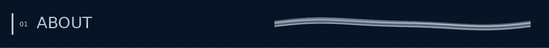
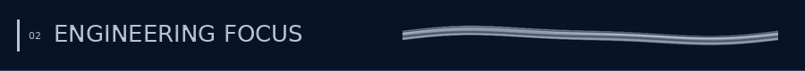
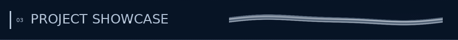
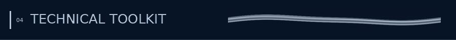
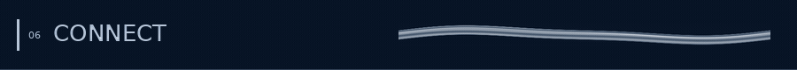

  

  <b>B.Eng (Hons) Electrical & Computer Systems Engineering · Minor in Artificial Intelligence</b> 
  Monash University Malaysia · Electrical & Electronic Engineering exchange at the University of Sheffield

  <a href="#about">About</a> · <a href="#focus">Focus</a> · <a href="#projects">Projects</a> · <a href="#toolkit">Toolkit</a> · <a href="#experience">Experience</a> · <a href="#connect">Connect</a>

## 

I'm **Khoo Zi Yee**, an engineering student working across **digital hardware, embedded systems, computer vision and signal processing**. My experience spans Verilog processor design, STM32 acquisition and processing, Python vision algorithms, and TETRA radio validation at Motorola Solutions.

## 

| Domain | Experience & keywords |
| :--- | :--- |
| **Digital hardware** | Verilog · processor datapaths · FSMs · FPGA implementation |
| **Embedded & DSP** | STM32 · C · ADC sampling · timer interrupts · SPI/UART · filtering |
| **Computer vision** | OpenCV · NumPy · Gabor filtering · homographies · k-means · image restoration |
| **Radio & validation** | TETRA · GNSS · SPIRENT · RF testing support · audio/power/digital troubleshooting · ESD |
| **Engineering software** | C++ · Java · LabVIEW workflows · PowerShell automation · LTspice |

## 

<b>01 / Computer Vision · Enhancement, Stitching & Segmentation</b>

 

**Python · OpenCV · NumPy**

A collection of coursework projects implementing and examining image-processing algorithms.

| Project | Methods & implementation | Libraries / tools |
| :--- | :--- | :--- |
| **Fingerprint enhancement & candidate-feature detection** | Custom convolution · gradient/orientation analysis · orientation-aware Gabor filtering | Python · OpenCV |
| **Panorama stitching** | Feature detection and matching · homography estimation · perspective transformation · interpolation and blending | Python |
| **Image segmentation & region proposals** | K-means from first principles · colour quantisation · colour-plus-spatial superpixels · region proposals | Python · NumPy · OpenCV |
| **Image reconstruction & restoration** | Multivariate linear regression · local-neighbourhood modelling · corrupted-pixel experiments · spatial filtering | Python · NumPy |

<!-- Add actual repository links. Candidate fingerprint features are not presented as verified biometric minutiae. No unverified PSNR or accuracy figures are stated. -->

<b>02 / Dual-STM32 Embedded Audio Processing System</b>

 

**C · Python · STM32 · ADC · SPI/UART · Real-Time Processing**

A team-of-five project combining two STM32 microcontrollers with PC-side processing.

| Aspect | Work |
| :--- | :--- |
| **Acquisition** | 12-bit ADC sampling · timer/interrupt-driven signal acquisition |
| **Communication** | Inter-device data exchange using SPI/UART |
| **Processing** | Moving-average filtering · outlier rejection · Python/C processing pipeline |
| **Control** | Ultrasonic proximity-triggered acquisition and timer-based control |
| **My contribution** | Interrupt-driven acquisition, inter-device communication and real-time processing |

<!-- Board model, IDE and measured throughput can be added once supplied. -->

<b>03 / Multicycle Processor · Digital Design & FPGA</b>

 

| Aspect | Work |
| :--- | :--- |
| **Design** | Verilog processor datapath and finite-state-machine control |
| **Platform** | Intel DE10-Lite FPGA |
| **Development** | Verilog testbench work · simulation · FPGA implementation |
| **Tools** | Verilog · Quartus Prime · ModelSim |

<!-- Test counts, timing figures and instruction lists remain omitted pending verification. -->

<b>04 / Real-Time Traffic Control · Embedded Systems</b>

 

A team project integrating sensing, analog circuitry and software control.

| Aspect | Work |
| :--- | :--- |
| **Control** | FSM logic · Python–Arduino integration using PyMata4 |
| **Sensing** | Ultrasonic sensors · LDR · op-amp comparators |
| **Circuitry** | 74HC595 shift registers · NE556 timers · RC timing networks · MOSFETs |
| **Stack** | Python · Arduino UNO · circuit prototyping |

<b>05 / Transformation-Invariant Image Identification · C++</b>

 

An individual project matching unknown images against a known-image database across rotations and reflections.

| Aspect | Work |
| :--- | :--- |
| **Matching** | Image statistics · geometric transformations · SHA-256 hashing · database lookup |
| **Transformations** | Rotation and reflection variants |
| **Design** | Object-oriented classes · inheritance · polymorphism |
| **Stack** | C++ · Linux |

<!-- Working grayscale identification is the demonstrated result; do not imply the RGB matching path is complete. -->

<b>06 / Numerical Analysis, Optimisation & Prototyping</b>

 

| Project | Methods / work | Stack |
| :--- | :--- | :--- |
| **Robust regression** | Huber loss · gradient descent with momentum · convergence analysis | Python |
| **Industrial pH neutralisation & dosing** | Sensor-offset correction · time-series visualisation · piecewise curve fitting · bisection for pH 7 | Python · NumPy · Matplotlib |
| **Tank-drainage simulation** | Differential-equation modelling · Euler's method | Python |
| **Signals & Systems** | Downsampling · noise analysis · bandpass filtering | Signal-processing coursework |
| **Blu Glow** | Team device prototype · enclosure design · electronics and control software | SolidWorks · hardware prototyping |

## 

<b>Languages, Libraries & Computation</b>

 

| Category | Toolkit |
| :--- | :--- |
| **Languages** | Python · C · C++ · Java · Verilog · PowerShell |
| **Vision & scientific libraries** | OpenCV · NumPy · Matplotlib |
| **Scientific computing** | MATLAB · numerical modelling · optimisation · signal processing |
| **Software concepts** | OOP · inheritance/polymorphism · data structures · hashing |

<b>Hardware, Embedded & Test</b>

 

| Category | Toolkit |
| :--- | :--- |
| **Digital design** | Quartus Prime · ModelSim · DE10-Lite |
| **Embedded** | STM32 · Arduino UNO · PyMata4 · ADCs · timers · interrupts · SPI/UART |
| **Circuit simulation & CAD** | LTspice · SolidWorks |
| **Radio validation & automation** | SPIRENT GNSS simulation · LabVIEW · Windows CMD · PowerShell |

## 

<b>Motorola Solutions / Electrical Engineering Intern · TETRA</b>

 

**November 2025 – February 2026**  
**GNSS · RF/Analog Hardware · Audio · Reliability · Automation**

| Workstream | What I worked on | Tools / measurements |
| :--- | :--- | :--- |
| **GNSS qualification** | Characterised GPS, Galileo, GLONASS and BeiDou performance, including cold/hot-start behaviour | SPIRENT · C/N0 · 2D positional accuracy · Time-to-First-Fix |
| **GNSS data capture** | Recorded and reviewed receiver performance measurements | Manual capture · LabVIEW-assisted workflows |
| **TETRA radio & board validation** | Supported RF testing and component-level troubleshooting across power, audio and digital PCBs | Diagnostic logs · hardware fault analysis |
| **Howling suppression** | Characterised acoustic feedback/howling behaviour and assessed suppression | Audio-system validation |
| **ESD reliability** | Conducted contact- and air-discharge assessments | ESD testing |
| **Fault-diagnosis workflow** | Filtered diagnostic logs across 20 hardware units, shortening review from roughly a working day to about one hour | Keyword filtering · failure timestamps / signatures |
| **Printing automation** | Built a configurable batch-label workflow, removing repeated single-label prompts and a hardcoded printer-IP dependency in the existing process | PowerShell · Windows CMD · Zebra ZT610 · existing LabVIEW workflow |
| **Manufacturing support** | Assisted firmware flashing at BCM Electronics and checked installed software versions and hardware compatibility | TETRA flashing station · EMS partner coordination |

<!-- Add the precise standalone RF test procedures/instruments if available. EMS means the manufacturing partner here; ESD is the reliability test. -->

<b>Teaching, Leadership & Competition Results</b>

 

| Experience | Highlight |
| :--- | :--- |
| **Teaching** | TA experience in Computer Vision and Information & Networks |
| **ICMS Industry Insights** | Deputy Project Executive Director · consultant/stakeholder coordination with the organising team |
| **P&G PEAKathon 2025** | National Champion |
| **RIFAR Challenge 2026** | 1st Runner-Up, Marathon Track · flood-resilience proposal |
| **Huawei Sales Elite Challenge 2026** | B2B 1st Runner-Up · B2C 2nd Runner-Up |
| **UM Startup Investor Challenge** | Top 6 Finalist |

## 

Interested in **digital hardware, embedded systems, semiconductor technology and applied AI**.

| Platform | Find me |
| :--- | :--- |
| **LinkedIn** | [Khoo Zi Yee](https://www.linkedin.com/in/khoo-zi-yee/) |
| **Email** | [khooziyee@gmail.com](mailto:khooziyee@gmail.com) |
| **GitHub** | [ziyeekhoo](https://github.com/ziyeekhoo) · [Repositories](https://github.com/ziyeekhoo?tab=repositories) |

  

